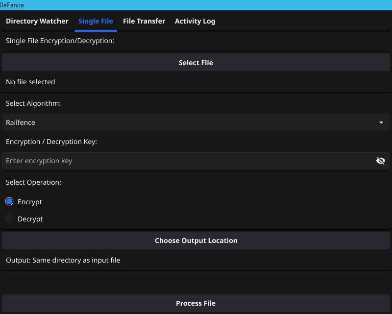

# DeFence

DeFence is a file encryption tool that uses custom implementations of the Rail**Fence**, XXTEA, and CBC algorithms.



⚠️ **WARRNING!**

This program was made for purely educational purposes and is not actively maintained.

## Installation

To get started with this project:
- Clone the repository
- Compile using `[go](https://go.dev)`
- Run the `main` file

```bash
git clone https://github.com/ikugo-dev/DeFence.git
cd DeFence
go build cmd/defence/main.go 
./main
```

## Features

- Single file encrpytion and decryption
- A filesystem monitor that automatically encrpyts files that enter the project folder; the output is on `./X/`
- TCP websocket connections to transfer files to known IP's that are listening

